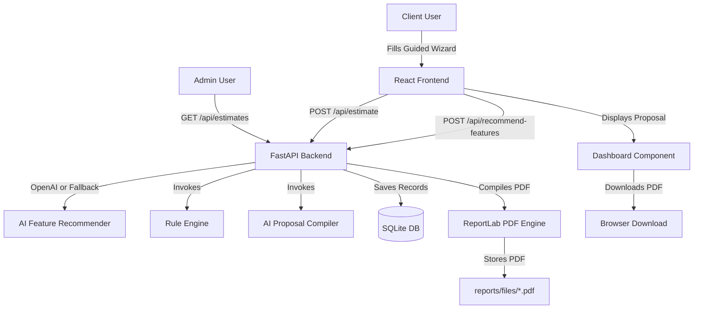

# ProjectPilot AI — Comprehensive Project Architecture & Documentation

## 1. Overview
**ProjectPilot AI** is an enterprise-grade AI software estimation and proposal generation platform. It automates client discovery by collecting project scope parameters, executing a deterministic estimation rule engine, utilizing LLMs for qualitative architectural synthesis, and outputting complete, production-ready PDF proposals and interactive client/admin dashboards.

---

## 2. Technology Stack

### Frontend Stack
* **Core Framework**: React 18 + Vite (Javascript ES2022)
* **Styling & UI**: Vanilla CSS + Tailwind CSS utilities with a dark-mode palette (`slate-950`, `indigo`, `purple`)
* **Animations**: `framer-motion` for fluid page transitions, card hover physics, loading progress bars, and modal overlays
* **Icons**: `lucide-react`
* **HTTP Client**: Standard Async `fetch` API (`frontend/src/services/api.js`)

### Backend Stack
* **Framework**: FastAPI (Python 3.10+) running asynchronously via Uvicorn
* **Database & ORM**: SQLite (`project_estimator.db`) managed through SQLAlchemy ORM
* **Data Validation**: Pydantic v2 schemas (`EstimateRequest`, `FullProposalResponse`, `RecommendRequest`)
* **PDF Report Compiler**: ReportLab Platypus engine for generating multi-page PDF proposals with dynamic tables and page numbering

### Artificial Intelligence & Automation
* **Primary LLM**: OpenAI GPT (`gpt-4o-mini`) via the `openai` Python SDK for executive summaries, stack recommendations, technical risks, roadmaps, and agile sprint plans.
* **Deterministic Rule Engine**: Custom mathematical fallback engine (`backend/rule_engine/engine.py`) that calculates developer hours, cost breakdown, timeline duration, and team sizing without relying on LLM outputs for cost logic.

---

## 3. Key System Features & Capabilities

### 1. Interactive Scoping Questionnaire
- Multi-step guided wizard for collecting:
  - Client Partner Info (Name, Email, Project Title, Description)
  - Business Industry Sector (E-Commerce, Finance, Healthcare, EdTech, Social Networking, SaaS, Custom)
  - Target Platforms (Web Application, Mobile Native App, Desktop Package)
  - Modular System Features (Authentication, Payments/Subscriptions, Analytics, Chat, Notifications, Search, Admin CMS, Multi-language, Third-party APIs)
- Real-time input validation and responsive step tracking.

### 2. AI Feature Recommendations
- Evaluates selected industry and feature set to propose domain-specific value additions (e.g., HIPAA compliance logging for Healthcare, Plaid API sync for Fintech, HLS streaming for EdTech).
- Provides explicit "Why" benefit explanations for every recommendation.
- Allows one-click adding and removing of recommended features to the final project scope.

### 3. Deterministic Estimation Rule Engine
- Standard Hourly Rate: `$100/hr`
- **Base Feature Hours**: Pre-configured effort mapping per module (e.g., Auth = 40h, AI Recommendations = 80h, Real-time Chat = 60h).
- **Platform Multipliers**:
  - Single Platform (Web=1.0x, Desktop=1.2x, Mobile=1.3x)
  - Dual Platforms (Web + Mobile = 1.7x, Web + Desktop = 1.5x, Mobile + Desktop = 1.8x)
  - All Three Platforms (Web + Mobile + Desktop = 2.2x)
- **Industry Risk Multipliers**:
  - E-Commerce: `1.2x`
  - Finance: `1.4x`
  - Healthcare: `1.5x`
  - Education / SaaS: `1.1x`
- **Team Sizing & Duration Calculation**:
  - `≤ 100h`: 1 Full-Stack Developer
  - `101h - 300h`: 2 Developers (Frontend + Backend)
  - `301h - 600h`: 3 Engineers (Frontend + Backend + QA/PM)
  - `> 600h`: 5 Team Members (PM + UI/UX + Frontend + Backend + QA)
- **Cost Allocation Breakdown**:
  - Design: 15%
  - Frontend: 35%
  - Backend: 30%
  - Quality Assurance: 12%
  - Project Management: 8%

### 4. Interactive Proposal Dashboard
- Displays calculated metrics (Total Hours, Total Cost, Estimated Weeks, Recommended Team Size).
- Visual budget pie-chart breakdown and role distribution cards.
- Multi-tab navigation:
  - **Overview**: Executive summary, business domain parameters, target platforms.
  - **Scope Features**: Interactive checklist of chosen & AI-recommended features.
  - **Tech Stack**: Architectural tier specifications (Frontend, Backend, Database, Hosting, Integrations).
  - **Roadmap & Sprints**: 3-Phase roadmap timeline and Sprint-by-Sprint agile deliverables.
  - **Risks & Mitigations**: Identified technical risk factors with concrete mitigation strategies.

### 5. Automated PDF Report Generation
- Multi-page PDF proposal generated using ReportLab Platypus.
- Includes cover page, metadata table, executive summary, objectives grid, core features matrix, visual architecture diagram, technology stack table, roadmap table, agile sprint planner, budget allocation table, technical risks table, and next steps checklist.
- Downloadable via `/api/estimate/{project_id}/pdf`.

### 6. Admin Control Panel
- Password-protected administrative view (`/admin`).
- Lists all generated client proposals stored in SQLite.
- Enables viewing full proposal details and deleting legacy projects (which automatically deletes SQLite records and associated PDF files on disk).

---

## 4. System Architecture & Data Flow



---

## 5. API Endpoints Reference

| Method | Endpoint | Description |
| :--- | :--- | :--- |
| `POST` | `/api/estimate` | Computes rule engine estimate, calls AI response generator, saves project/estimate/AI data to SQLite, compiles PDF, and returns proposal payload. |
| `POST` | `/api/recommend-features` | Generates custom feature recommendations based on industry and selected basic features. |
| `GET` | `/api/estimates` | Lists all created project proposals (Admin Dashboard). |
| `GET` | `/api/estimate/{project_id}` | Retrieves structured data for a single proposal by ID. |
| `DELETE` | `/api/estimate/{project_id}` | Deletes project proposal from database and removes PDF file from filesystem. |
| `GET` | `/api/estimate/{project_id}/pdf` | Serves the generated ReportLab PDF file download. |

---

## 6. Database Schema (SQLite via SQLAlchemy)

- **`projects`**: `id` (UUID Primary Key), `name`, `email`, `project_name`, `description`, `industry`, `platforms` (JSON), `features` (JSON), `created_at`.
- **`estimates`**: `id` (Auto-increment PK), `project_id` (FK -> projects.id), `hours`, `cost`, `timeline`, `team` (JSON).
- **`ai_responses`**: `id` (Auto-increment PK), `project_id` (FK -> projects.id), `summary`, `tech_stack` (JSON), `risks` (JSON), `roadmap` (JSON), `sprint_plan` (JSON).
- **`reports`**: `id` (Auto-increment PK), `project_id` (FK -> projects.id), `pdf_path`, `created_at`.

---

## 7. Setup & Running Locally

### Backend Setup
```bash
cd backend
python -m venv venv
# Windows:
.\venv\Scripts\activate
pip install -r requirements.txt
uvicorn backend.api.main:app --reload --port 8000
```

### Frontend Setup
```bash
cd frontend
npm install
npm run dev
```
The frontend application will be running at `http://localhost:5173`.
