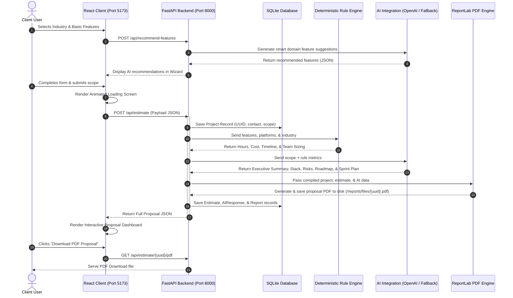
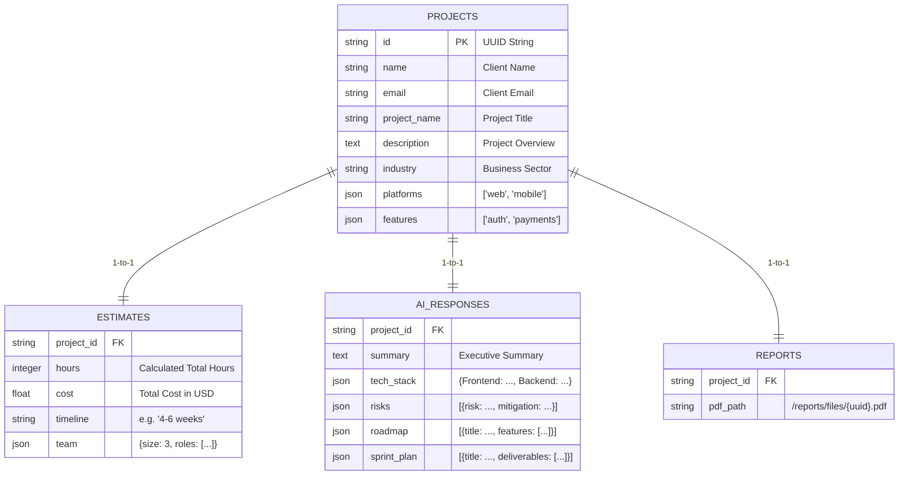

# ProjectPilot AI — Complete System Architecture, Technical Guide & Explanation Manual

---

## 1. Executive Summary & Presentation Guide

### 1.1 What is ProjectPilot AI?
**ProjectPilot AI** is an enterprise-grade, automated software discovery, estimation, and proposal generation platform. It transforms how IT consulting firms, software agencies, and freelance developers conduct client discovery. Instead of spending hours or days manually calculating developer hours, writing technical scope documents, recommending technology stacks, and designing PDF proposals, ProjectPilot AI automates the entire end-to-end workflow in **under 10 seconds**.

---

### 1.2 How to Explain This Project (Elevator Pitches)

#### 30-Second Elevator Pitch:
> *"I built **ProjectPilot AI**, an enterprise software estimation platform. When clients want a software quote, they fill out an interactive guided wizard selecting their industry, target platforms, and feature requirements. My platform uses a **hybrid dual-engine architecture**: a deterministic rule engine calculates exact developer hours, cost breakdowns, team sizes, and timelines with 100% mathematical predictability, while an LLM (OpenAI GPT-4o-mini with local template fallback) synthesizes technical recommendations, multi-phase roadmaps, agile sprint plans, and risk mitigations. Finally, the backend dynamically compiles a production-ready, 7-page styled PDF proposal report using ReportLab, complete with visual charts and client dashboards."*

#### 2-Minute Technical Summary:
> *"The project is built with a modern full-stack decoupled architecture:*
> 
> * **Frontend**: Built with **React 18**, **Vite**, and **Tailwind CSS**, featuring custom glassmorphic aesthetics, fluid card transitions via **Framer Motion**, and dynamic multi-tab interactive dashboards.
> * **Backend**: Built using **FastAPI (Python 3.10+)** with **Async Uvicorn**, enforcing strict runtime data validation with **Pydantic v2** and clean ORM mappings using **SQLAlchemy**.
> * **Hybrid Estimation System**: We intentionally separated financial math from generative AI. Mathematical effort, team allocation (1 to 5 developers), and budget breakdowns (design 15%, frontend 35%, backend 30%, QA 12%, PM 8%) are handled by a **deterministic Python rule engine**. AI (OpenAI API or local template fallback) is reserved for qualitative synthesis—writing executive summaries, technology stack recommendations, 3-phase roadmaps, and agile sprint checklists.
> * **Document Engine**: Uses **ReportLab Platypus** to construct a multi-page branded PDF proposal with cover pages, custom color palettes, tabular data grids, and canvas page numbers.
> * **Persistence**: Uses an **SQLite database** with cascade deletions, managing relational data for Projects, Estimates, AI Responses, and PDF Reports, alongside a secure password-protected **Admin Control Panel**."*

---

## 2. Technical Stack Overview

| Tier | Technologies Used | Purpose / Key Capabilities |
| :--- | :--- | :--- |
| **Frontend Framework** | **React 18 + Vite** | Fast Single-Page Application (SPA) rendering, hot-reloading development, optimized production builds. |
| **UI Styling** | **Tailwind CSS + Vanilla CSS** | Glassmorphic cards, dark mode palette (`slate-950`, `indigo-600`, `purple-500`), custom scrollbars, responsive grids. |
| **Animations** | **Framer Motion** | Micro-interactions, progressive step wizard slide transitions, smooth loading bar animations, tab switches. |
| **Icons & Vectors** | **Lucide React** | Scalable SVG icons for navigation, features, platforms, and metrics cards. |
| **Backend Framework** | **FastAPI (Python 3.10+)** | High-performance, asynchronous RESTful API framework with built-in Swagger/OpenAPI documentation (`/docs`). |
| **Data Validation** | **Pydantic v2** | Enforces type safety, email validation (`EmailStr`), and request payload schema verification. |
| **Database & ORM** | **SQLite + SQLAlchemy** | Local relational data storage (`project_estimator.db`) using Python declarative models with foreign key constraints. |
| **AI Integration** | **OpenAI SDK (`gpt-4o-mini`)** | Structured JSON generation for feature recommendations, executive summaries, technical roadmaps, and agile sprints. |
| **Fallback Engine** | **Custom Python Logic** | Zero-downtime offline fallback mechanism that generates full proposals using industry-tailored knowledge templates if no API key is provided. |
| **PDF Generation** | **ReportLab Platypus** | Programmatically compiles styled multi-page PDF documents with tables, custom headers/footers, and page numbers. |

---

## 3. End-to-End System Data Flow & Architecture

### 3.1 Data Flow Sequence Diagram



---

## 4. Deep-Dive into Core Modules

### 4.1 The Deterministic Rule Engine (`backend/rule_engine/engine.py`)

#### Why a Rule Engine?
Using Large Language Models (LLMs) to perform financial math or project scope estimation is dangerous because LLMs are non-deterministic—they can hallucinate different prices for the exact same input. 

ProjectPilot AI solves this by keeping cost estimation **100% deterministic and mathematical**.

#### Estimation Formula Breakdown:

$$\text{Total Base Hours} = \sum \text{BaseHours}(\text{Feature}_i)$$

1. **Base Feature Hours**:
   * `auth` (Authentication & Profiles): **40h**
   * `dashboard` (Analytics Dashboard): **50h**
   * `payments` (Stripe Subscriptions): **30h**
   * `chat` (Real-time Messaging): **60h**
   * `ai` (AI & Smart Recommendations): **80h**
   * `telehealth` (Video Consultations): **60h**
   * `security` (Compliance Auditing): **50h**
   * Default fallback for unmapped feature: **20h**

2. **Platform Multipliers**:
   Building for multiple platforms requires cross-platform testing, shared API development, and specialized UI layout adjustments.
   * **Single Platform**:
     * Web only: `1.0x`
     * Desktop only: `1.2x`
     * Mobile Native only: `1.3x`
   * **Dual Platforms**:
     * Web + Desktop: `1.5x`
     * Web + Mobile: `1.7x`
     * Mobile + Desktop: `1.8x`
   * **All Three Platforms**:
     * Web + Mobile + Desktop: `2.2x`

3. **Industry Complexity Multipliers**:
   * `other`: `1.0x`
   * `education` / `saas`: `1.1x`
   * `ecommerce` / `social`: `1.2x`
   * `finance`: `1.4x`
   * `healthcare`: `1.5x` (Reflects HIPAA compliance, strict encryption, data privacy regulations)

4. **Total Hours & Cost Calculation**:
   $$\text{Total Hours} = \text{Round}(\text{Base Hours} \times \text{Platform Multiplier} \times \text{Industry Multiplier})$$
   $$\text{Total Cost} = \text{Total Hours} \times \$100/\text{hr}$$

5. **Dynamic Team Sizing Logic**:
   * **$\le 100$ Hours**: 1 Resource — `["Full-Stack Developer"]`
   * **$101 - 300$ Hours**: 2 Resources — `["Frontend Developer", "Backend Developer"]`
   * **$301 - 600$ Hours**: 3 Resources — `["Frontend Developer", "Backend Developer", "QA Engineer / PM"]`
   * **$> 600$ Hours**: 5 Resources — `["Project Manager", "UI/UX Designer", "Frontend Developer", "Backend Developer", "QA Engineer"]`

6. **Budget Allocation Matrix**:
   * **UI/UX Design**: $15\%$
   * **Frontend Engineering**: $35\%$
   * **Backend Engineering**: $30\%$
   * **Quality Assurance (QA)**: $12\%$
   * **Project Management (PM)**: $8\%$

---

### 4.2 AI & Fallback System (`backend/ai/integration.py`)

#### Dual Architecture (OpenAI + High-Fidelity Local Fallback)
ProjectPilot AI features a **bulletproof dual-mode system**. If an `OPENAI_API_KEY` is present, it uses OpenAI's `gpt-4o-mini` with strict JSON response mode (`response_format={"type": "json_object"}`). If no API key is set or if network requests fail, it **automatically falls back** to local algorithmic generators.

#### Key Functions:
1. `generate_feature_recommendations(industry, features)`:
   * Analyzes current industry and selected basic features.
   * Proposes domain-specific high-value features (e.g. *Telehealth Video Rooms* for Healthcare, *Fintech Compliance Audits* for Finance).
   * Prevents duplicate recommendations.

2. `generate_ai_response(project_name, description, industry, platforms, features, estimate_info)`:
   * Generates a 3-5 sentence executive summary tailored to the client.
   * Constructs custom **Tech Stack Recommendations** based on target platforms (e.g. React Native for Mobile, Electron for Desktop, FastAPI + PostgreSQL for Backend).
   * Identifies top 3 **Technical Risks & Mitigation Strategies**.
   * Constructs a **3-Phase Project Implementation Roadmap** (Phase 1: Foundations, Phase 2: Core Modules, Phase 3: QA & Security).
   * Generates **Agile Sprint Plans** (2 to 5 sprints with specific deliverables, effort breakdowns, and progress indicators).

---

### 4.3 Database Architecture (`backend/database/models.py`)

ProjectPilot AI uses SQLite with SQLAlchemy ORM. The relational model utilizes standard UUIDs and cascading deletes (`cascade="all, delete-orphan"`).



---

### 4.4 Automated PDF Proposal Generator (`backend/reports/pdf_gen.py`)

The PDF proposal is compiled on-the-fly using **ReportLab Platypus** (Page Layout and Typography Using Scripts).

#### PDF Structure (7 Pages):
1. **Page 1: Cover Page**: Styled document title, purple accent divider bar, project metadata table (Client Name, Industry, Platforms, Date).
2. **Page 2: Executive Summary & Project Objectives**: Business goals, time-to-market highlights, compliance & future expansion cards.
3. **Page 3: Scope of Work & Features**: 2-column core features matrix and AI-recommended enhancements table.
4. **Page 4: Solution Architecture & Tech Stack**: Visual 3-tier architecture diagram table (Presentation, Service, Persistence) and tech stack specification grid.
5. **Page 5: Implementation Roadmap & Agile Sprints**: 3-Phase milestone table and Sprint-by-Sprint agile checklists.
6. **Page 6: Team Allocation & Budget Breakdown**: Core effort metrics header, allocated team roles list, and full itemized financial table (Design, Frontend, Backend, QA, PM, Hosting).
7. **Page 7: Technical Risks & Execution Next Steps**: Risk mitigation matrix and green callout box for kick-off next steps.

---

### 4.5 React Frontend Component Structure

```text
frontend/src/
├── App.jsx                   # Central View Controller & Router State
├── index.css                 # Tailwind CSS directives & custom utility classes
├── services/
│   └── api.js                # Async fetch wrapper methods (createEstimate, getRecommendations, etc.)
└── components/
    ├── LandingPage.jsx       # Dark-mode hero section with key features & CTA button
    ├── Questionnaire.jsx     # 4-Step Guided Wizard with real-time field validation
    ├── LoadingScreen.jsx     # Animated progress bar with multi-phase loading status text
    ├── Dashboard.jsx         # Proposal Dashboard with charts, tabs, sprint plans, & PDF download
    ├── AdminLogin.jsx        # Protected authentication modal for administrative management
    └── AdminDashboard.jsx    # Table listing all stored client estimates with deletion & review options
```

#### Step Wizard Breakdown (`Questionnaire.jsx`):
* **Step 1: Contact Details**: Client Name, Email, Project Name, Project Description.
* **Step 2: Industry & Platforms**: Industry selector (E-Commerce, Healthcare, Finance, SaaS, etc.) & Target Platforms multi-select checkboxes (Web, Mobile, Desktop).
* **Step 3: Basic Features**: Multi-select cards for core features (Auth, Payments, Chat, AI, Analytics, Admin Panel, etc.).
* **Step 4: AI Recommendations**: Live-fetched custom recommendations where users can add or remove suggested features with a single click before submitting.

---

## 5. API Endpoints Reference

| Method | Endpoint | Request Body | Response Description |
| :--- | :--- | :--- | :--- |
| `POST` | `/api/recommend-features` | `{ industry: str, features: List[str] }` | Returns list of recommended features with description and effort rating. |
| `POST` | `/api/estimate` | `EstimateRequest` payload | Computes rule engine, calls AI/fallback, saves to SQLite, generates PDF, and returns full proposal JSON. |
| `GET` | `/api/estimates` | None | Returns list of all generated project estimates (used by Admin Panel). |
| `GET` | `/api/estimate/{project_id}` | None | Returns detailed JSON for a single proposal by UUID. |
| `DELETE` | `/api/estimate/{project_id}` | None | Deletes project record from SQLite and removes corresponding PDF from filesystem. |
| `GET` | `/api/estimate/{project_id}/pdf` | None | Serves downloadable PDF file via `FileResponse`. |

---

## 6. How to Present This Project in an Interview or Project Defense

When showcasing this project to interviewers, clients, or evaluators, follow this structured narrative:

1. **Highlight the Problem**:
   *"Manual project estimation is slow, error-prone, and inconsistent across different developers."*

2. **Demonstrate the Solution**:
   *"ProjectPilot AI automates scope discovery, mathematical estimation, technical recommendations, and proposal compilation into a seamless 10-second web experience."*

3. **Emphasize Architectural Excellence**:
   * **Separation of Concerns**: Deterministic math in Python rule engine vs. qualitative synthesis in AI.
   * **Resilience**: Zero-downtime fallback system ensuring full functionality even without internet or OpenAI API keys.
   * **Production Output**: Generates real, beautifully formatted PDF documents rather than simple text outputs.

4. **Showcase Admin Capabilities**:
   *"The built-in Admin Panel gives software agency managers complete visibility into incoming client leads, database records, and generated proposals."*

---

## 7. Local Setup & Execution Commands

### Backend Setup:
```bash
cd backend
python -m venv venv

# Windows Activation:
.\venv\Scripts\activate

# Install dependencies:
pip install -r requirements.txt

# Run FastAPI Server:
uvicorn backend.api.main:app --reload --port 8000
```
*API Documentation will be accessible at: `http://localhost:8000/docs`*

### Frontend Setup:
```bash
cd frontend
npm install
npm run dev
```
*Frontend application will be running at: `http://localhost:5173`*

---
*Document compiled for ProjectPilot AI Architecture & Defense Preparation.*
