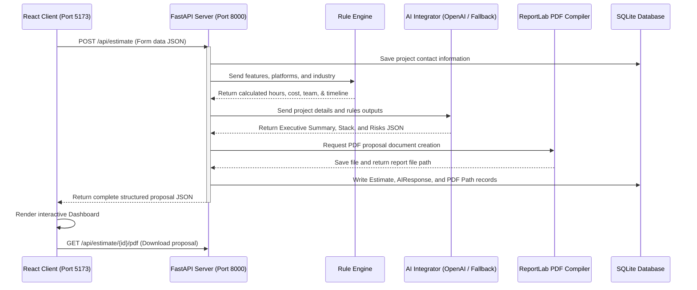

# AI Project Estimator & Proposal Generator

An intelligent full-stack web application designed to automate the early software discovery and consulting phase. By collecting requirements through an interactive questionnaire, the platform estimates development hours, budgets, and timelines via a strict rule-based engine, generates professional executive summaries and tech recommendations using AI, and compiles downloadable PDF proposals.

---

## 🚀 Key Features

*   **Guided Discovery Questionnaire**: A gorgeous, multi-step React form to collect contact info, business domain (industry), platform selections, and modular functional features.
*   **Deterministic Rule Engine**: Never lets AI calculate pricing or timelines. Applies custom platform (e.g. mobile, multi-platform) and industry-specific (e.g. healthcare regulatory, fintech security) effort multipliers.
*   **Dual AI Architecture**: Automatically calls the OpenAI API to write tailored executive summaries and tech stacks. If no API key is set, it falls back seamlessly to high-quality, pre-configured industry templates.
*   **Professional PDF Generator**: Compiles proposals on-the-fly into structured PDF files using ReportLab flowables, tables, and custom hex color branding.
*   **Interactive SaaS Dashboard**: Displays estimated hours, budgets, timeline ranges, and recommended team sizing alongside a CSS effort-distribution chart, tech stack cards, and risk mitigations.
*   **SQLite Storage**: Retains all submissions, estimates, AI answers, and PDF document paths locally.

---

## 🛠️ Technology Stack & Justification

### Frontend Client
*   **React + Vite**: Provides a blazing fast, hot-reloading development server with standard code-splitting capabilities.
*   **Tailwind CSS v4**: Utility-first CSS styling enabling high-performance designs, dark themes, and glassmorphism without bloated configuration.
*   **Framer Motion**: Delivers smooth page transitions, progress bar filling animations, and card hover scaling effects.
*   **Lucide React**: Clean vector iconography for dashboard categories and controls.

### Backend Services
*   **FastAPI (Python)**: A high-performance web framework using asynchronous Python logic, automated OpenAPI documentation, and strict CORS handling.
*   **Pydantic**: Performs run-time validation on client requests (e.g. strict `EmailStr` and JSON array structures).
*   **SQLAlchemy ORM**: Handles SQL database mappings cleanly through Python classes, preventing raw query injection.
*   **ReportLab**: Programmatically draws proposal reports to PDF, structuring scope items in tabular formats.
*   **OpenAI SDK**: Interfaces with standard GPT models (`gpt-4o-mini`) using JSON schema outputs.

---

## 📈 System Architecture Flow



---

## 📂 Project Structure

```text
Ai_estimator/
├── backend/
│   ├── api/
│   │   ├── __init__.py
│   │   └── main.py          # FastAPI application, routers & CORS
│   ├── database/
│   │   ├── __init__.py
│   │   ├── connection.py    # SQLAlchemy engine, session maker & Base
│   │   └── models.py        # Table models (Projects, Estimates, AIResponses, Reports)
│   ├── rule_engine/
│   │   ├── __init__.py
│   │   └── engine.py        # Calculation multipliers (hours, cost, team size)
│   ├── ai/
│   │   ├── __init__.py
│   │   └── integration.py   # OpenAI client prompts & local templating fallback
│   ├── reports/
│   │   ├── __init__.py
│   │   ├── pdf_gen.py       # PDF document creation using ReportLab
│   │   └── files/           # Generated PDF proposals target folder
│   ├── requirements.txt     # Python requirements
│   └── project_estimator.db # Auto-created SQLite DB file
└── frontend/
    ├── src/
    │   ├── main.jsx
    │   ├── index.css        # Tailwind v4 import
    │   ├── App.jsx          # UI layout view router
    │   ├── services/
    │   │   └── api.js        # API fetch client calls
    │   └── components/
    │       ├── LandingPage.jsx  # Hero description
    │       ├── Questionnaire.jsx# Guided form steps
    │       ├── LoadingScreen.jsx# Processing status bar animations
    │       └── Dashboard.jsx    # Estimates tables & PDF triggers
    ├── index.html
    ├── vite.config.js
    └── package.json
```

---

## ⚙️ Local Setup Instructions

### Prerequisites
*   **Python**: Version `3.13` or similar installed.
*   **Node.js**: Version `24` or similar and **npm** installed.

### 1. Backend Service Configuration
1.  Navigate to the project root directory.
2.  Install Python dependencies:
    ```bash
    python -m pip install -r backend/requirements.txt
    ```
3.  *(Optional)* Create a `.env` file in the project root containing your OpenAI credentials:
    ```env
    OPENAI_API_KEY=your_openai_api_key_here
    ```
    *If no key is configured, the application automatically uses local high-fidelity templates.*
4.  Launch the FastAPI server:
    ```bash
    python -m uvicorn backend.api.main:app --port 8000
    ```
    The server will startup and listen on `http://127.0.0.1:8000`.

### 2. Frontend Client Setup
1.  Navigate to the `frontend/` directory:
    ```bash
    cd frontend
    ```
2.  Install npm packages:
    ```bash
    npm install
    ```
3.  Launch the Vite developer client:
    ```bash
    npm run dev -- --port 5173
    ```
    Open your browser and navigate to **`http://localhost:5173`** to access the application.
