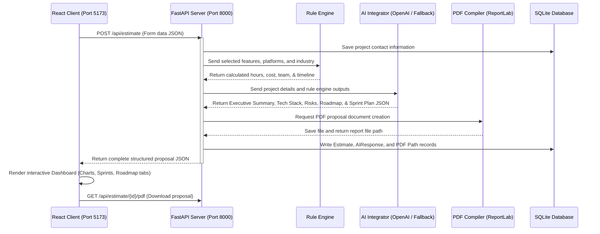

# ProjectPilot AI — Project Estimator & Proposal Generator (v2.0)

An intelligent, full-stack enterprise automation platform designed to streamline software discovery and consulting. By collecting project scope requirements through a dynamic React-based guided wizard, the platform calculates development costs using a deterministic rule engine, generates professional roadmaps, agile sprint plans, and tech recommendations using AI, and compiles downloadable branded PDF proposals.

---

## 🚀 Key Features

*   **Guided Discovery Questionnaire**: A multi-step form built with glassmorphic styles and custom input validations to collect project metadata, industry domains, target platforms, and feature scopes.
*   **Smart AI Feature Recommendation Engine**: Dynamically recommends tailored add-on features (e.g., *telehealth* for healthcare, *compliance audits* for finance, *inventory management* for e-commerce) based on the chosen industry, allowing users to build comprehensive scopes with one click.
*   **Deterministic Rule Engine**: Enforces strict, predictable pricing and effort calculations using multi-layered criteria (base feature hours, platform multipliers, and industry complexity factors) rather than unpredictable AI math.
*   **Dual AI Architecture**: Uses the OpenAI API (`gpt-4o-mini`) to write executive summaries, suggest technology stacks, map milestones, and construct sprint checklists. Automatically falls back to high-fidelity, hand-crafted templates if no API key is present.
*   **Dynamic Roadmaps & Agile Sprint Plans**: Automatically schedules core features across a 3-phase development roadmap and segments objectives, deliverables, and effort across logical 2-week sprints.
*   **Professional PDF Generator**: Compiles proposals on-the-fly using `ReportLab`, producing beautifully styled documents with cover pages, custom page-breaks, clean table layouts, and headers/footers.
*   **Admin Dashboard**: A secure management portal where administrators can view all client submissions, review calculated metrics, download generated proposal PDFs, and delete database records.
*   **SQLite Storage**: Retains all client submissions, estimations, and AI responses locally with database cascade deletes.

---

## ⚙️ System Architecture Flow

The following sequence diagram outlines the end-to-end data flow when a client requests a proposal:



---

## 🛠️ Technology Stack

### Frontend Client
*   **React + Vite**: Delivers hot-reloading dev servers and optimized static production builds.
*   **Tailwind CSS**: Utility-first CSS engine powering custom glassmorphic panels, dark themes, and responsive layout structures.
*   **Framer Motion**: Controls smooth multi-step card transitions, progress bars, and hover animations.
*   **Lucide React**: Vector icons representing dashboards, categories, and metrics.

### Backend Services
*   **FastAPI (Python)**: High-performance web framework using asynchronous logic and auto-generated interactive OpenAPI docs (`/docs`).
*   **Pydantic (v2)**: Performs run-time validation on client requests (e.g. strict `EmailStr` and structure).
*   **SQLAlchemy ORM**: Handles SQL database mappings cleanly through Python classes, preventing raw query injection.
*   **ReportLab**: Programmatically draws proposal reports to PDF, structuring scope items, milestones, and risks in tabular layouts.
*   **OpenAI SDK**: Interfaces with standard GPT models (`gpt-4o-mini`) using structured JSON outputs.

---

## 📂 Project Structure

```text
Ai_estimator/
├── backend/
│   ├── api/
│   │   ├── __init__.py
│   │   └── main.py          # FastAPI application routers, endpoints, and CORS config
│   ├── database/
│   │   ├── __init__.py
│   │   ├── connection.py    # SQLAlchemy engine, session maker, and DB path mapping
│   │   └── models.py        # Relational models (Project, Estimate, AIResponse, Report)
│   ├── rule_engine/
│   │   ├── __init__.py
│   │   └── engine.py        # Calculation multipliers (hours, cost, team size, timelines)
│   ├── ai/
│   │   ├── __init__.py
│   │   └── integration.py   # OpenAI client prompts & local templating fallback
│   ├── reports/
│   │   ├── __init__.py
│   │   ├── pdf_gen.py       # PDF document creation using ReportLab Flowables
│   │   └── files/           # Generated PDF proposals target folder
│   ├── requirements.txt     # Python requirements
│   └── project_estimator.db # Auto-created SQLite DB file
└── frontend/
    ├── src/
    │   ├── main.jsx
    │   ├── index.css        # Tailwind imports and base style system
    │   ├── App.jsx          # UI layout view router (Landing -> Questionnaire -> Dashboard)
    │   ├── services/
    │   └── components/
    │       ├── LandingPage.jsx      # Portal hero description
    │       ├── Questionnaire.jsx    # Guided multi-step form wizard
    │       ├── LoadingScreen.jsx    # Processing status bar animations
    │       ├── Dashboard.jsx        # Estimates tables, interactive roadmap, & PDF downloads
    │       ├── AdminLogin.jsx       # Protected administrator authentication layout
    │       └── AdminDashboard.jsx   # List of all estimates, details view, and record deletion
    ├── index.html
    ├── vite.config.js
    └── package.json
```

---

## ⚙️ Local Setup Instructions

### Prerequisites
*   **Python**: Version `3.10+` installed.
*   **Node.js**: Version `18+` and **npm** installed.

### 1. Backend Service Configuration
1.  Navigate to the project root directory.
2.  Install Python dependencies:
    ```bash
    python -m pip install -r backend/requirements.txt
    ```
3.  *(Optional)* Create a `.env` file in the project root containing your OpenAI credentials:
    ```env
    OPENAI_API_KEY=your_openai_api_key_here
    ```
    *If no key is configured, the application automatically uses local high-fidelity templates.*
4.  Launch the FastAPI server:
    ```bash
    python -m uvicorn backend.api.main:app --port 8000 --reload
    ```
    The server will start and listen on `http://127.0.0.1:8000`.

### 2. Frontend Client Setup
1.  Navigate to the `frontend/` directory:
    ```bash
    cd frontend
    ```
2.  Install npm packages:
    ```bash
    npm install
    ```
3.  Launch the Vite developer client:
    ```bash
    npm run dev -- --port 5173
    ```
    Open your browser and navigate to **`http://localhost:5173`** to access the application.

---

## 📊 Estimation Formula Rules

The rule engine calculates effort based on baseline requirements, platform configurations, and industry complexities:

*   **Base Hours**: Baseline modules (e.g. `auth` is **40 hours**, `payments` is **30 hours**, `ai` is **80 hours**).
*   **Platform Multipliers**:
    *   Single: Web (**1.0**), Desktop (**1.2**), Mobile (**1.3**)
    *   Dual: Web+Desktop (**1.5**), Web+Mobile (**1.7**), Mobile+Desktop (**1.8**)
    *   All Three: Web+Mobile+Desktop (**2.2**)
*   **Industry Multipliers**:
    *   `other`: **1.0**
    *   `education`/`saas`: **1.1**
    *   `ecommerce`/`social`: **1.2**
    *   `finance`: **1.4**
    *   `healthcare`: **1.5**
*   **Cost Matrix**: $\text{Hours} \times \$100/\text{hour}$.
